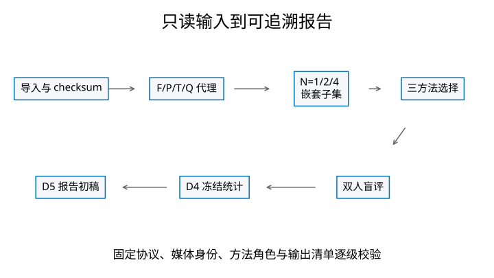
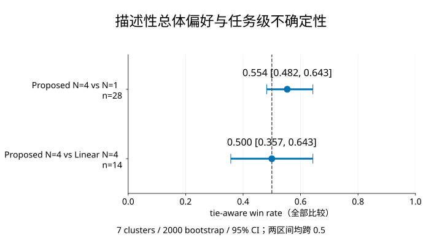
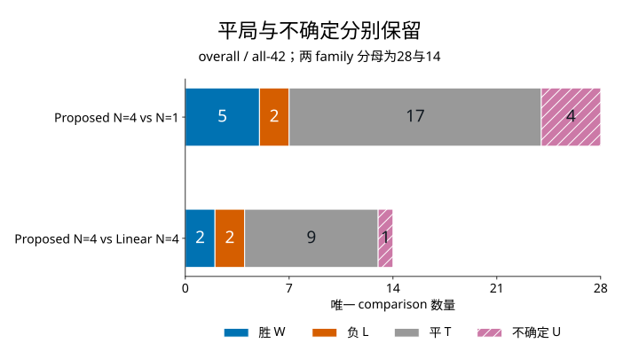
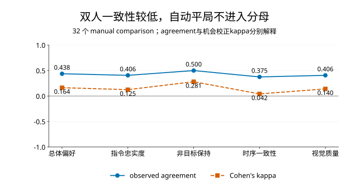

# 指令视频编辑候选选择与盲评系统：D5 报告初稿

## 摘要

约束式 N=4 相对 N=1 有描述性正向点估计，但 CI 跨 0.5；相对 Linear N=4 未观察到差异。当前证据不足以支持显著或稳定优势。工程贡献是可复现的候选选择、盲评、统计与身份审计。

## 问题与范围

同一输入的随机候选质量存在差异，本系统研究怎样在固定候选池中进行可复现选择。真实输入为 10 个 sample、50 个既有 AnyV2V 候选。7 个颜色/局部编辑任务的 35 个候选完成 CPU 定量评分；3 个对象转换任务的 15 个候选只作 qualitative_only 能力边界。本阶段没有生成视频、训练模型或新增效果测量。

## 系统与身份审计

原始媒体、帧序列、配置、候选角色及产物清单逐级绑定 SHA。D5 在通过独立 D4 验证后读取机器事实，保留稳定数据和运行回执，失败输出保留，成功目录不覆盖。

## F/P/T/Q 与约束式选择

| 维度 | 计算含义 | 边界 |
|---|---|---|
| F 指令忠实度代理 | 前景内变化与目标色支持度的几何平均；local 只计新增目标色 | 颜色出现不能证明目标物体或正确子部位出现 |
| P 非目标保持代理 | 1 减 mask 外输入与候选的绝对误差 | 前景内部非目标破坏可能漏检 |
| T 时序一致性代理 | 1 减相邻编辑残差变化；裁剪到单位区间 | 没有光流或运动补偿 |
| Q 视觉质量代理 | 梯度保留、正常曝光和亮度稳定性的几何平均 | 低层图像特征不能替代感知质量判断 |

mask 来自 DAVIS 前景对象，按非零类别索引解码。local 的 mask 不是背包、头盔或车灯的专门分割。

三方法为 N=1 baseline、equal-linear N=4 与 constrained Pareto/max-min N=4。工程设计保留 random、equal-linear、constrained-pareto 在 N=1/2/4 的完整选择记录；N=1 时三方法选中同一候选。

排序先用子集内部稳定 rank-percentile。线性方法取四维等权平均，允许维度补偿。约束式方法要求 F 不低于中位数、P 不低于下四分位数，然后求 Pareto 非支配前沿，优先最大化最弱维度，其次几何平均，最后按候选 ID 稳定决胜。若可行集为空，按 min(F,P)、T、Q 和 ID 回退。

D2 共 26 次 Pareto fallback，全部在 N=2。它是工程现象，不是两个正式盲评 family 之外的新比较组。

## 双人盲评与保守聚合

方法、seed、分数与路径在评审界面隐藏，位置方向独立平衡。两位评审各完成 32 个实际观看比较。正式分母是 42 个唯一 comparison = 32 个 human_pair + 10 个共享 automatic tie。媒体相同的自动平局仅计一次，不伪造成两份人答，也不进入 agreement/kappa。

双方同一 decisive 保留该结果；decisive 与 tie 聚合为 tie；方向相反或任一 uncertain 聚合为 uncertain。tie 与 uncertain 在 tie-aware 中均计半分，但原始计数始终分开。主表保留全部比较，不做事后删题或子组检验。

## 正式主结果

Proposed N=4 vs N=1：W/L/T/U = 5/2/17/4，n=28；tie-aware 0.554，95% CI [0.482, 0.643]。

Proposed N=4 vs Linear N=4：W/L/T/U = 2/2/9/1，n=14；tie-aware 0.500，95% CI [0.357, 0.643]。

| 比较 | 字段 | W | L | T | U | n | tie-aware | decisive（诊断） | 95% CI | 有效/无效 bootstrap |
|---|---|---:|---:|---:|---:|---:|---:|---:|---|---|
| Proposed N=4 vs N=1 | 总体偏好 | 5 | 2 | 17 | 4 | 28 | 0.554 | 0.714 | [0.482, 0.643] | 2000/0 |
| Proposed N=4 vs N=1 | 指令忠实度 | 3 | 4 | 19 | 2 | 28 | 0.482 | 0.429 | [0.393, 0.554] | 2000/0 |
| Proposed N=4 vs N=1 | 非目标保持 | 3 | 5 | 16 | 4 | 28 | 0.464 | 0.375 | [0.375, 0.554] | 2000/0 |
| Proposed N=4 vs N=1 | 时序一致性 | 2 | 1 | 24 | 1 | 28 | 0.518 | 0.667 | [0.464, 0.571] | 2000/0 |
| Proposed N=4 vs N=1 | 视觉质量 | 4 | 4 | 16 | 4 | 28 | 0.500 | 0.500 | [0.411, 0.607] | 2000/0 |
| Proposed N=4 vs Linear N=4 | 总体偏好 | 2 | 2 | 9 | 1 | 14 | 0.500 | 0.500 | [0.357, 0.643] | 2000/0 |
| Proposed N=4 vs Linear N=4 | 指令忠实度 | 2 | 1 | 10 | 1 | 14 | 0.536 | 0.667 | [0.429, 0.643] | 2000/0 |
| Proposed N=4 vs Linear N=4 | 非目标保持 | 2 | 2 | 8 | 2 | 14 | 0.500 | 0.500 | [0.357, 0.643] | 2000/0 |
| Proposed N=4 vs Linear N=4 | 时序一致性 | 2 | 1 | 10 | 1 | 14 | 0.536 | 0.667 | [0.429, 0.643] | 2000/0 |
| Proposed N=4 vs Linear N=4 | 视觉质量 | 2 | 2 | 8 | 2 | 14 | 0.500 | 0.500 | [0.357, 0.643] | 2000/0 |

CI 使用 7 个 sample clusters、2000 次预冻结 bootstrap。每次整体重采样任务，不把比较或字段当独立样本。区间仅描述任务级小样本不确定性，跨半分不能转写为效果证明。

补充 decisive 诊断为 0.714 / 0.500，只在胜负子集上计算，不能替代主胜率。

[原始精度主表](d5_generated/tables/main-results.csv)

## 一致性与 Bradley–Terry

只有两位评审，其中一位是开发者参与者，采用同机配合式盲评。只有 7 个 sample clusters，区间较宽；一致性较低，overall agreement 14/32 = 0.438，kappa 0.164。CPU F/P/T/Q 是代理指标，15 个对象转换候选未量化。

五字段 exact agreement 为 7/32 = 0.219。四类 canonical 值分别保留，自动平局没有进入一致性分母。

BT 状态 ok，只使用 overall 的 11 条 decisive 边。中心化 ability：Proposed N=4 0.305430、Linear N=4 0.305430、N=1 -0.610860。Proposed 与 Linear 相同；边少、估计脆弱，不解释为稳定总体排名。

[一致性完整表](d5_generated/tables/agreement.csv)

## 确定性案例

案例规则在查看正式媒体前冻结。成功、失败、不确定均按指定 family 内稳定键取首项，缺类明确 unavailable。定性边界按任务 ID 取首项并显示全部候选，不赋予胜负。所有定量页同时显示输入、Proposed 和 comparator。

所有方法统一使用已验证 16 帧序列的索引 0、5、10、15，对应首帧、三分之一、三分之二与末帧。完整图像不裁切，页面展示缩放保持比例，原始帧像素不改动；静态帧不能替代整段视频评估。

- [成功案例1](../../artifacts/defense_mvp/DEFENSE-MVP-D5-v01/report/cases/case-1.html)：正式聚合为 Proposed win；available。
- [失败案例1](../../artifacts/defense_mvp/DEFENSE-MVP-D5-v01/report/cases/case-2.html)：正式聚合为 Proposed loss；available。
- [不确定案例1](../../artifacts/defense_mvp/DEFENSE-MVP-D5-v01/report/cases/case-3.html)：正式聚合为 uncertain；available。
- [定性边界案例1](../../artifacts/defense_mvp/DEFENSE-MVP-D5-v01/report/cases/case-4.html)：对象转换未量化，不参与主结果；available。

[案例总览](../../artifacts/defense_mvp/DEFENSE-MVP-D5-v01/report/cases/index.html)；完整 D4 失败索引共 9 条，内部 trace 保留反查关系。本报告不使用评审 notes 补充故事，不根据图像观感改换样例。

## 成本与复现

E0 历史 50 候选生成 runtime 合计 12413.711 s；报告过的 peak VRAM 最大 22476.000 MB。D2 metrics elapsed 27.671 s，按全部验证候选为 0.553 s/candidate。D4 compute 0.430 s。

D2 selection timer 为 unavailable，不以估算补齐。评审 A/B current-view server elapsed 为 2018.096 / 3138.452 s，含停顿、后台和恢复，不能解释为主动观看时间或精确工时。

[成本、状态与来源](d5_generated/tables/costs.csv)；[事实注册表](../../artifacts/defense_mvp/DEFENSE-MVP-D5-v01/report/report-data.json)；[输入身份](../../artifacts/defense_mvp/DEFENSE-MVP-D5-v01/report/input-manifest.json)。

使用 `python -m defense_mvp.reporting report` 指定完整 D4/D2 输入、冻结配置与新输出根；`verify-report` 重建稳定报告内容并验证图、案例和 Slides 语义。命令和依赖见回执。PPTX保留实际SHA，内部时间戳不承诺字节级重建。报告/表/图的稳定输出通过跨路径重建验证。

## 威胁、结论与后续

只有两位评审，其中一位是开发者参与者，采用同机配合式盲评。只有 7 个 sample clusters，区间较宽；一致性较低，overall agreement 14/32 = 0.438，kappa 0.164。CPU F/P/T/Q 是代理指标，15 个对象转换候选未量化。

约束式 N=4 相对 N=1 有描述性正向点估计，但 CI 跨 0.5；相对 Linear N=4 未观察到差异。当前证据不足以支持显著或稳定优势。工程贡献是可复现的候选选择、盲评、统计与身份审计。

未来研究可增加任务与独立评审、改进语义指标，并在新协议下验证；这些未在本阶段实施。D5 交付报告与 Slides 初稿。D6 的展示冻结、录屏和计时演练尚未启动。

## 机器事实来源摘要

D4 主表 SHA-256：`8948b6807301e72df61bac749b628409f5b48e33df347895ebd699616819d968`。

D4 summary SHA-256：`a329396cddbbe0eaca66430c7df0743c6e16c885f181f4fd90c49ab7e7326e17`。

两 family 的共享自动平局分别为 6/4；计入主分母，不进入一致性。
